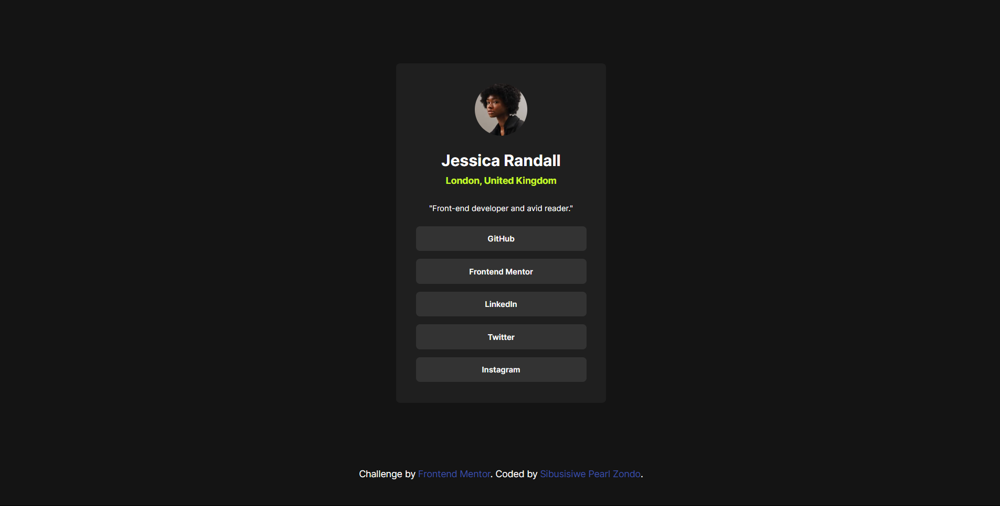

# Frontend Mentor - Social links profile solution

This is a solution to the [Social links profile challenge on Frontend Mentor](https://www.frontendmentor.io/challenges/social-links-profile-UG32l9m6dQ). Frontend Mentor challenges help you improve your coding skills by building realistic projects. 

## Table of contents

- [Overview](#overview)
  - [The challenge](#the-challenge)
  - [Screenshot](#screenshot)
  - [Links](#links)
  - [Built with](#built-with)
  - [What I learned](#what-i-learned)
  - [Continued development](#continued-development)
- [Author](#author)

## Overview

### The challenge

Users should be able to:

- See hover and focus states for all interactive elements on the page

### Screenshot

### Links

- Solution URL: (https://www.frontendmentor.io/solutions/social-links-profile-solution-C7mv14AS37)
- Live Site URL: (https://spzondo.github.io/social-links/)

### Built with

- Semantic HTML5 markup
- CSS 

### What I learned

I learned how to center buttons and responsiveness

### Continued development

-I would like to focus on making responsive web pages

## Author

- Frontend Mentor - [@SPZONDO](https://www.frontendmentor.io/profile/SPZONDO)

